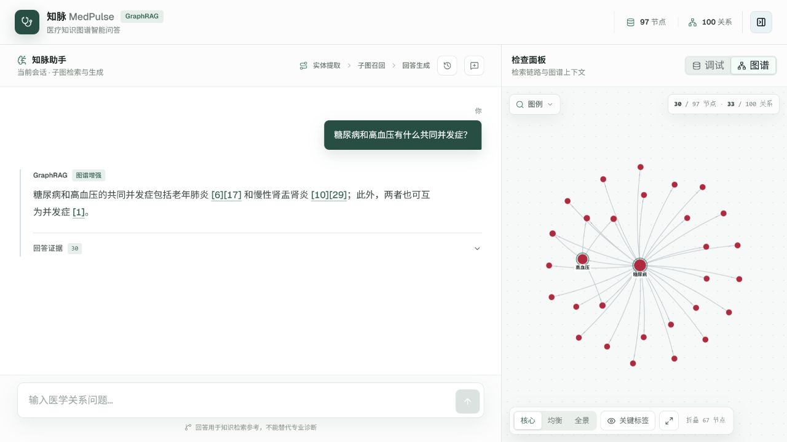
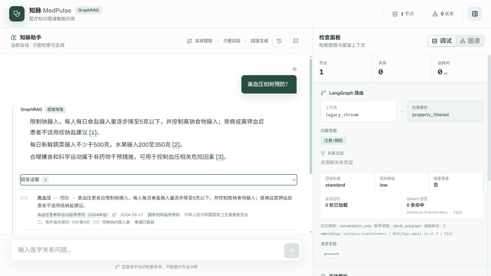
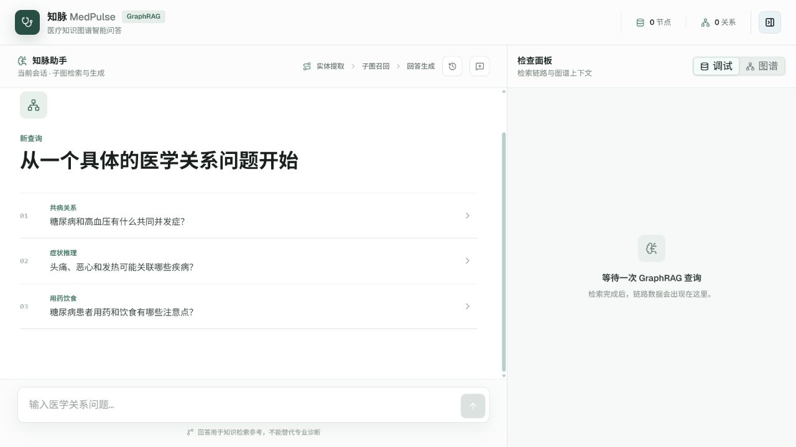
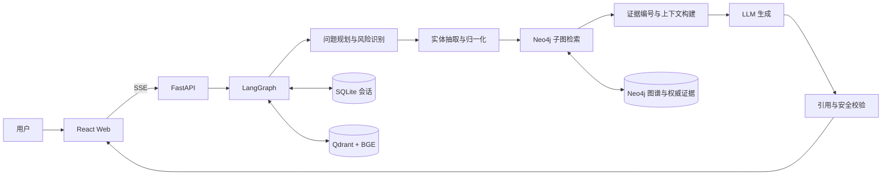
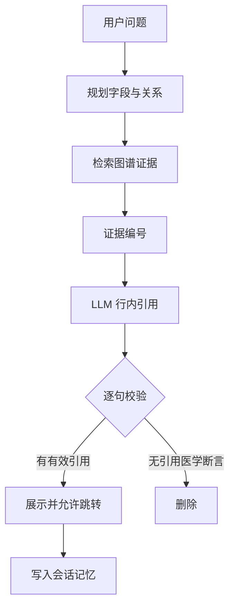

# 知脉 MedPulse

> 医疗知识图谱 GraphRAG 智能问答系统：让回答可追溯、可检查、可回归验证。

[](https://www.python.org/)
[](https://fastapi.tiangolo.com/)
[](https://react.dev/)
[](https://langchain-ai.github.io/langgraph/)
[](#测试与评估)
[](https://github.com/umi3730/medpulse-rag/actions/workflows/ci.yml)

知脉将医学实体抽取、Neo4j 子图检索、LangGraph 工作流、LLM 回答生成和持久化记忆组合为一套可解释的多轮问答系统。与只把检索文本交给模型的普通 RAG 不同，知脉会规划问题所需字段与关系、限制检索范围、为医学事实分配引用编号，并在输出前拦截没有证据支持的医学断言。

> [!CAUTION]
> 本项目用于 GraphRAG 与医疗知识工程研究，不提供诊断、处方或个体化治疗建议。工程评估分数不等于临床正确率。

## 效果预览

### GraphRAG 问答与子图检索



| 权威证据引用 | GraphRAG 工作台 |
| --- | --- |
|  |  |

截图来自真实运行环境：左侧展示回答与可跳转引用，右侧展示检索子图、LangGraph 路由和上下文统计。示例医学内容仅用于知识检索演示。

## 项目亮点

- **可观测 GraphRAG**：LangGraph 编排记忆加载、意图识别、实体处理、检索、上下文构建、生成、降级和记忆更新。
- **按问题精确检索**：根据 `requested_fields` 与关系过滤器只检索用户所问内容，减少无关属性和高密度邻接扩散。
- **可信引用闭环**：回答中的 `[1]`、`[2]` 可跳转到具体图谱属性、关系或权威 `EvidenceClaim`。
- **确定性幻觉拦截**：有图谱上下文时逐句检查引用，无引用的医学断言不会展示，也不会写入长期记忆。
- **医疗安全边界**：加减药量、停药和急救等高风险问题采用可审计的确定性兜底。
- **记忆与证据分离**：SQLite/Qdrant 只帮助理解会话；历史模型回答不会被重新当作医学事实。
- **完整会话管理**：支持恢复、搜索、分页、重命名和删除；删除时同步清理 SQLite 与 Qdrant。
- **用户隔离**：所有会话操作同时按 `user_id + session_id` 过滤，相同会话 ID 的不同用户互不影响。
- **权威证据渐进治理**：新证据包含来源机构、原文链接、发布日期、章节、定位和审核状态，不覆盖旧数据。

## 量化结果

| 指标 | 结果 |
| --- | ---: |
| GraphRAG 回归请求 | 33 / 33 成功 |
| 工程回归综合分 | 0.9951 |
| 引用有效性 | 1.0000 |
| 引用完整率 | 1.0000 |
| 引用忠实度代理指标 | 1.0000 |
| 无依据断言拦截 | 1.0000 |
| 后端自动化测试 | 57 项通过 |
| BGE 改写检索 Recall@1 | 1.00 |
| 确定性哈希 Recall@1 | 0.50 |

典型“感冒用药”查询优化：

| 优化项 | 优化前 | 优化后 |
| --- | ---: | ---: |
| 子图节点 | 162 | 22 |
| 子图关系 | 219 | 22 |
| 检索耗时 | 约 5.1 秒 | 约 0.53 秒 |

以上结果来自项目回归集与本地测试环境，用于比较工程改动，不代表医疗效果或临床准确率。

## 系统架构



### LangGraph 工作流

```text
load_memory
  → classify_intent
  → extract_entities
  → normalize_entities
  → retrieve_subgraph
  → build_context
  → generate_answer / fallback_answer
  → update_memory
```

前端右侧检查面板展示意图、请求字段、关系过滤、规范化实体、Qdrant 命中、Embedding 配置、子图统计、模型与耗时，便于定位问题发生在规划、检索还是生成阶段。

## 可信回答设计



证据等级与审核状态是两个不同概念：

- `legacy_unverified`：历史互联网数据，未核验。
- `official_guidance`：国家机构发布的指导资料。
- `source_verified`：链接、发布机构和原文内容已核对。
- `clinically_reviewed`：必须额外记录临床审核人和审核日期。

`source_verified` 不等于临床专家审核。当前仓库提供 5 条国家卫生健康委员会高血压结构化样例，作为渐进式数据治理的最小闭环。

## 技术栈

| 层级 | 技术 |
| --- | --- |
| Web | React 19、TypeScript、Vite 8、Tailwind CSS 4、shadcn、react-force-graph-2d |
| API | Python、FastAPI、SSE、Pydantic |
| 工作流 | LangGraph、可配置 LLM API |
| 图谱 | Neo4j |
| 会话 | SQLite |
| 语义记忆 | Qdrant、BAAI/bge-small-zh-v1.5 |
| 评估 | unittest、自建 33 题回归集、Embedding 对比测试 |

## 仓库结构

```text
medpulse-rag/
├── graphrag/              # 规划、实体、检索、上下文、生成、记忆与 LangGraph
├── server/                # FastAPI、SSE、会话与图谱接口
├── web/                   # React 前端、图谱、证据和调试面板
├── knowledge_graph/       # Neo4j 构建与权威证据导入
├── evaluation/            # 33 题回归集与向量检索对比
├── tests/                 # 后端单元与接口测试
├── data/evidence/         # 仓库维护的结构化权威证据样例
├── dict/                  # 兼容实体词典
├── docs/ARCHITECTURE.md   # 组件职责与工程取舍
└── scripts/               # 可选旧数据下载工具
```

上游大体积数据、旧项目截图、爬虫、运行数据库、模型缓存和构建产物均不纳入仓库。

## 快速开始

### 1. 环境要求

- Python 3.10+
- Node.js 20+
- Neo4j 5.x 或 Neo4j Aura
- Ollama，或 OpenAI/Anthropic 兼容的 LLM API

### 2. 安装后端

```powershell
git clone https://github.com/umi3730/medpulse-rag.git
cd medpulse-rag

python -m venv .venv
.\.venv\Scripts\Activate.ps1
pip install -r requirements.txt
Copy-Item .env.example .env
```

编辑 `.env`，配置 Neo4j 与 LLM：

```dotenv
NEO4J_URI=bolt://127.0.0.1:7687
NEO4J_USER=neo4j
NEO4J_PASSWORD=your_password

LLM_PROVIDER=openai
LLM_MODEL=your_model
LLM_BASE_URL=https://your-provider.example/v1
OPENAI_API_KEY=your_key
```

也可以使用本地 Ollama：

```dotenv
LLM_PROVIDER=ollama
LLM_MODEL=qwen3:8b
LLM_BASE_URL=http://127.0.0.1:11434
```

### 3. 准备 Neo4j 数据

已有 Neo4j 数据库时可以跳过旧数据导入。需要从零复现兼容知识图谱时，先按需下载上游数据：

```powershell
.\.venv\Scripts\python.exe scripts\download_legacy_data.py
.\.venv\Scripts\python.exe knowledge_graph\main.py
```

旧数据默认标记为 `legacy_unverified`，不随 Git 仓库分发。权威高血压样例可独立校验和幂等导入：

```powershell
# 只读校验
.\.venv\Scripts\python.exe knowledge_graph\evidence_importer.py `
  data\evidence\hypertension.jsonl

# 写入当前配置的 Neo4j
.\.venv\Scripts\python.exe knowledge_graph\evidence_importer.py `
  data\evidence\hypertension.jsonl --apply
```

### 4. 启动项目

后端：

```powershell
.\.venv\Scripts\python.exe -m server.app
```

前端：

```powershell
cd web
npm install
npm run dev
```

访问 <http://127.0.0.1:5173>，后端默认监听 <http://127.0.0.1:8000>。

## 会话与数据边界

| 存储 | 保存内容 | 是否作为医学证据 |
| --- | --- | --- |
| Neo4j | 医学实体、关系、EvidenceClaim、EvidenceSource | 是 |
| SQLite | 会话、问答轮次、历史实体 | 否 |
| Qdrant | BGE 编码的历史问题 | 否 |

浏览器生成匿名 `user_id` 并保存在 `localStorage`，当前 `session_id` 保存在 `sessionStorage`。历史会话支持恢复、搜索、分页、重命名与删除。删除操作会同步清理 SQLite 与 Qdrant，但不会影响使用相同 `session_id` 的其他用户。

主要接口：

```text
POST   /api/graphrag/chat
POST   /api/graphrag/chat/stream
GET    /api/graphrag/sessions
GET    /api/graphrag/sessions/{session_id}
PATCH  /api/graphrag/sessions/{session_id}
DELETE /api/graphrag/sessions/{session_id}
```

## 测试与评估

后端测试：

```powershell
.\.venv\Scripts\python.exe -m unittest discover -s tests -p "test_*.py"
```

前端检查：

```powershell
cd web
npm run lint
npm run build
```

验证评估数据集：

```powershell
.\.venv\Scripts\python.exe -m evaluation.run_evaluation --validate-only
```

后端运行时执行完整 33 题回归：

```powershell
.\.venv\Scripts\python.exe -m evaluation.run_evaluation
```

仅重跑指定样例：

```powershell
.\.venv\Scripts\python.exe -m evaluation.run_evaluation `
  --case-id drug-dose-high-risk `
  --case-id drug-stop-high-risk
```

Embedding 对比：

```powershell
.\.venv\Scripts\python.exe -m evaluation.run_embedding_evaluation --provider sentence_transformers
.\.venv\Scripts\python.exe -m evaluation.run_embedding_evaluation --provider hash
```

指标定义与限制见 [`evaluation/README.md`](evaluation/README.md)。

## 当前限制

- 兼容知识图谱来自历史互联网数据，不能直接用于临床决策。
- 权威证据目前只完成高血压最小样例，尚未形成完整医学知识库。
- `citation_faithfulness` 是文本重叠代理指标，不能替代 NLI 或医学专家审核。
- 当前身份是匿名浏览器用户，尚未接入账号、JWT 与服务端权限体系。
- 历史会话不保存每轮完整图谱快照。
- 前端主包仍有约 523KB，后续可继续拆分图谱与调试面板。

## 项目来源与原创工作

本项目基于 [liuhuanyong/QASystemOnMedicalKG](https://github.com/liuhuanyong/QASystemOnMedicalKG) 的医疗知识图谱数据、实体词典和基础规则问答代码继续开发。上游完成了疾病中心的医疗实体、关系整理和规则问答能力。

MedPulse 主要新增和重构内容：

- React GraphRAG 工作台、SSE 流式交互和图谱可视化。
- LangGraph 状态工作流与结构化问题规划。
- Neo4j 按字段/关系子图检索与密度控制。
- SQLite/Qdrant/BGE 两级持久化会话记忆。
- 用户隔离和完整会话管理。
- 行内证据引用、无依据断言拦截和高风险安全兜底。
- EvidenceClaim/EvidenceSource 权威证据模型。
- 33 题评估集、Embedding 对比和 57 项自动化测试。

上游旧截图、爬虫和大体积数据不在本仓库分发。项目保留清晰致谢与数据边界，不将上游数据整理工作声明为原创成果。

## 文档

- [系统架构与工程取舍](docs/ARCHITECTURE.md)
- [数据目录与旧数据边界](data/README.md)
- [评估指标说明](evaluation/README.md)

## License 与使用说明

本仓库未对上游医疗数据重新授权。使用相关词典、数据或代码前，请同时遵循上游项目许可与原始数据来源要求。知脉新增代码仅用于学习、研究和工程展示，不应直接用于医疗决策。
